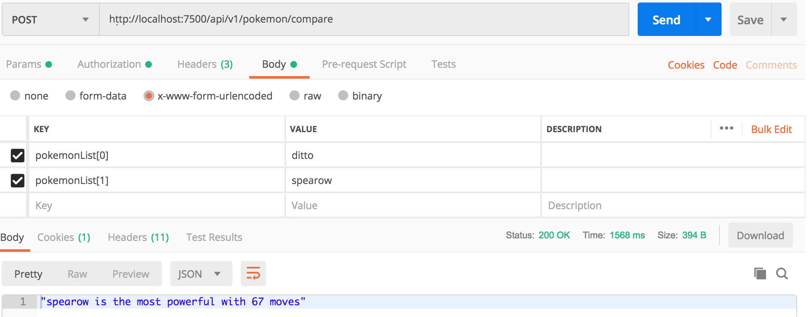

# Pokemon API Test
## Overview
A REST API that performs the following functions
 - Accepts a list of pokemon names and returns the most powerful one. 
 - Returns list of all pokemons
 - Returns a pokemon's details based on name parameter 

## Requirements
1. [Docker](https://www.docker.com/products/docker)
2. [Docker Compose](https://docs.docker.com/compose/install/) (should come with [Docker CE](https://store.docker.com/search?offering=community&type=edition) for macOS and Windows)

## Setup
- `git clone https://github.com/ahmedolaibrahim/pokemon`
- Navigate to the project directory `cd pokemon`
- Create a .env file from example.env sample file and update the necessary variables

## How To Run
- `docker-compose up` (first time run will perform build)
    - you can force a fresh build with `--build`
    - you can background (run without holding up your CLI) by using `--detach`
 
## Running Tests
From the commandline run the following commands
  - Navigate to the project directory  `cd pokemon`
  - Execute the following command `npm run test` to run the unit and integration tests
  

## Sample Environment Variable
 -  WHITELIST=['http://localhost:8080']
 -  PORT=8080
 -  REDIS_HOST=127.0.0.1
 -  REDIS_PORT=6379

 ## API Reference
 - GET - `/api/v1/pokemon` - returns list of all pokemons
    - Response
    

 - GET - `/api/v1/pokemon/name/:name` - returns a pokemon's details based on  name parameter
    - Request Parameter
       - name - `String`
    - Response
     
     
 - POST - `/api/v1/pokemon/compare`- compare a list of pokemons and return the most powerful
    - Request Parameter
      - pokemonList - `Array` e.g `['ditto', 'kakuna', 'spearow']`
    - Response
     

 ## Contributors

 [Ibrahim Ahmed](https://github.com/ahmedolaibrahim)